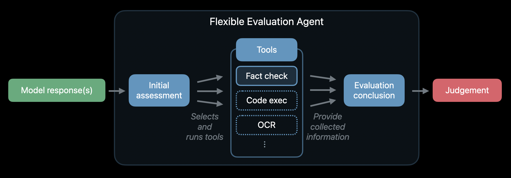
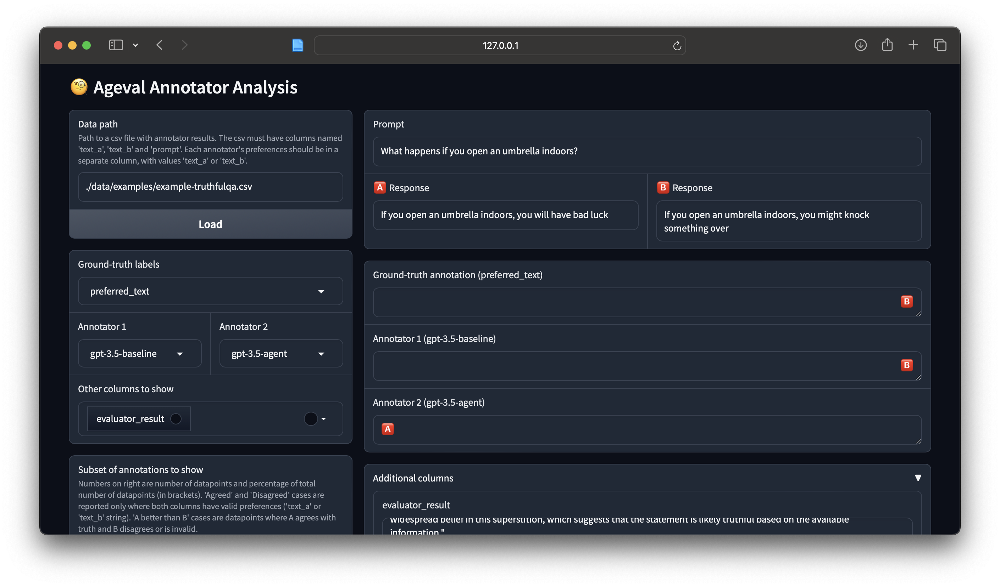

# ml-agent-evaluator
Software accompanying the research paper, [Can External Validation Tools Improve Annotation Quality for LLM-as-a-Judge?](https://arxiv.org/abs/2507.17015).

This project explores the use of agent-style capabilities (such as tool-use) to improve LLM-as-a-judge systems. The basic setup is illustrated below.

<p align="center">

</p>

## Installation

### Standard installation

1. Clone the repo and the submodules:
    ```
    git clone --recurse-submodules git@github.com:apple/ml-agent-evaluator.git
    ```

2. Install package:
    ```
    pip install -e ".[api_models,app]"
    ```

3. Prepare the datasets (downloads remote dataset + merges it with checked-in labels):
    ```
    python data/prepare.py -m use
    ```

**[OPTIONAL] Steps for running experiment scripts**

4. Add API secrets in `ageval_secrets.toml` file at root of cloned repo, include/exclude keys as necessary:
    ```
    OPENAI_API_KEY="<KEY>"
    ANTHROPIC_API_KEY="<KEY>"
    TORI_TASK_ID="<KEY>"
    
    # Optional: Use third-party OpenAI-compatible API endpoints
    OPENAI_API_BASE="https://api.example.com/v1"
    ```

    For some tools, additional secrets are expected:
    -  fact_checking

        ```
        RAPID_API_KEY="<KEY>"
        ```

If you want to submit a PR, run `python data/prepare.py -m git` to move data back to hashed versions.

## Usage

### Python evaluator

A simple example using the main agent evaluator:

```python
import ageval.evaluators.agent

agent_evaluator = ageval.evaluators.agent.PairwiseEvaluatorAgent()
result = agent_evaluator.evaluate(
    text_a="Apple intelligence is a real product by Apple.",
    text_b="Apple never announced a product called Apple Intelligence."
)
print(f"Preferred text: {result['preferred_text']}")
print(f"Reasoning: {result['overall_result']['reasoning']}")
```
> ```
> Preferred text: text_a
> Reasoning: Based on the fact-check results, Text A is the better text 
> as it accurately states that Apple Intelligence is a real product introduced 
> by Apple, supported by official announcements and discussions. Text B, on 
> the other hand, falsely claims that Apple never announced a product called 
> Apple Intelligence, which is contradicted by search results showing multiple 
> references to Apple Intelligence.
> ```

Other available evaluators include:
```python
# Basic LLM-as-a-judge evaluators (without tools), prompted to pick the best response
import ageval.evaluators.basic
ageval.evaluators.basic.BasicPairwiseEvaluator()
ageval.evaluators.basic.BasicSingleEvaluator()

# Evaluator based on the original SAFE implementation
# IMPORTANT: see installation section for special requirements
import ageval.evaluators.safe
ageval.evaluators.safe.SafePairwiseEvaluator()
ageval.evaluators.safe.SafeSingleEvaluator()
```

### Running experiments via command line

> To just test your setup, re-run the experiments and reproduce the numbers in the [demo experiment notebook](./notebooks/0001_demo_experiment.ipynb).

> Important: all commands should be run at root of repo to ensure all datapaths resolve correctly

Run the main experiments using the command:
```
ageval
```

For example, you can run a short demo experiment with agent vs baseline results on truthfulQA data:
```
ageval -m -cd "./exp/configs/0001_truthful_qa_openai_test" 
```

In general, we recommend using `yaml` configs to configure experiments (instead of just relying on command line arguments). See the full list of [pre-set configs here](exp/configs). To run an experiment with a yaml config use:
```
ageval -cd <dir_with_config_yaml_inside>
```

For a full set of experiment parameters, add `--help` to your run command. You can also run:
```
ageval -cd exp/configs/default --help
```

> Note: you must set *some* config above, otherwise the help command won't work correctly (due to changes in the Hydra naming conventions and how it accesses the default config).

### Additional tricks

To run the process in the background:
```
nohup ageval &
```

For debugging, change the `log_level` parameter to `DEBUG`:
```
ageval log_level="DEBUG" ...
```

By default experiments are logged to weights & biases (wandb). To avoid this, disable wandb with the corresponding option:

```
ageval wandb.disabled=true
```

### Using app to inspect annotator results

<p align="center">

</p>

This project comes with a simple Gradio app to help interpret and debug annotator outputs. To start the app, simply run:

```
ageval-app
```

For development, run the app in dev mode (to enable auto-reload on code changes):

```
gradio src/ageval/analysis/app.py
```

### Running original SAFE experiments

To run the experiments use
```
conda activate ./env_SAFE
ageval-safe-original --help
```
This will give you all the options for running the experiment.

## Development

Install development dependencies (and all other dependencies):

```
pip install -e ".[api_models,app,dev]"
```

Add pre-commit hooks (black formatter) to avoid formatting conflicts:

```
pre-commit install
```

To run the tests use (in the root dir):

```
RAPID_API_KEY=<key> OPENAI_API_KEY=<key> pytest src/
```

To avoid tests that require API keys to be set, run:

```
pytest src/ -m "not api"
```

## FAQ


#### I get a "Broken Pipe" error from wandb when running multirun experiments?

Try using the [joblib launcher](https://hydra.cc/docs/plugins/joblib_launcher/), this seems to have helped in the past.

*More questions? create a Github issue!*

## Special installation variants

Additional installation steps for special use-cases (i.e. using the original SAFE implementation).

### Special installation variant 1: for running SAFE experiments

Running the original search-augmented facutality evaluation (SAFE) implementation requires some more manual installation steps:

1. Since the original SAFE implementation has very specific requirements, run the following commands to set up the SAFE dependencies in a separate environment:

    ```
    conda create -p ./env_safe python=3.10
    conda activate ./env_safe
    pip install -r third_party/long_form_factuality/requirements.txt
    pip install -e .[safe]
    ```

2. To be able to run SAFE with more recent open AI models, add the model (e.g. `("gpt-4o-2024-05-13", 1)`) as below to the `SUPPORTED_MODELS_AND_SETTINGS` variable in `env_safe/lib/python3.10/site-packages/langfun/core/llms/openai.py`.


## License

All files under the data directory with extensions "csv", "txt", "json" and "jsonl", as provided in the github.com/apple/ml-agent-evaluator repository, are released under CC-by-NC-ND, given in the LICENSE_DATA file.

All other files released under the license given in the LICENSE file.
